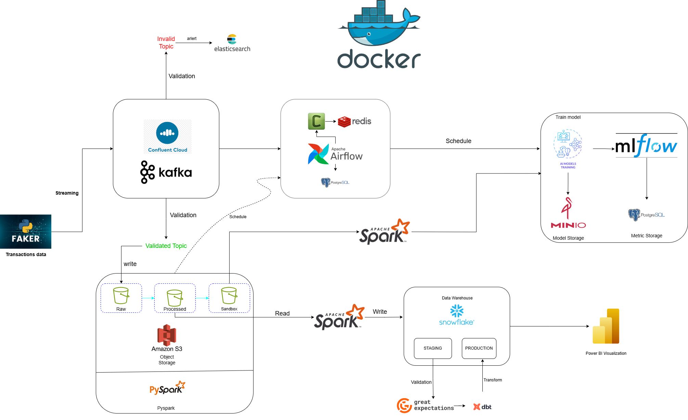
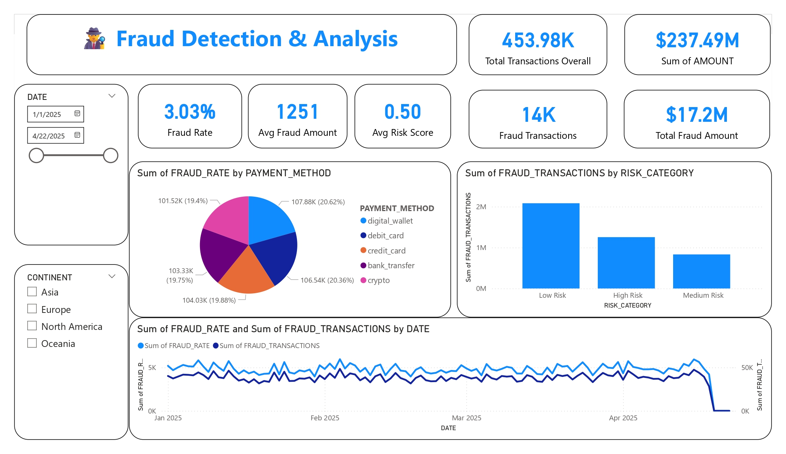
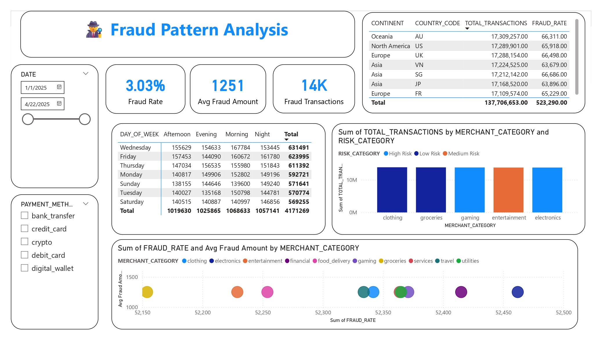

# 🕵️‍♂️ Fraud Detection & Analysis Pipeline

[]()
[](LICENSE)
[](https://www.docker.com/)

## 🎯 Project Objective

This project aims to build a **scalable**, **containerized** fraud detection and analytics pipeline using modern data engineering and machine learning tools. It supports real-time data streaming, robust validation, multi-stage storage, orchestrated ETL, automated model training/tracking, and insightful visualization.

---

## 🐳 Docker-ized Ecosystem

The entire infrastructure is containerized using **Docker** and **Docker Compose**. This ensures:
* **Reproducibility:** Consistent environments across development and deployment.
* **Scalability:** Easily scale individual services as needed.
* **Isolation:** Services run independently, minimizing conflicts.
* **Simplified Deployment:** Streamlined setup and teardown.

---

## 🗺️ System Architecture Overview

Visual representation of the end-to-end pipeline:


*Figure 1: High-level architecture of the fraud detection system.*

---

## ⚙️ Core Components Breakdown

### 1. **🐍 Synthetic Transaction Generator**
- **Tool:** Python script using the **Faker** library.
- **Purpose:** Generates simulated financial transaction data in real-time, mimicking real-world patterns.
- **Output:** Streams generated JSON messages directly into a Kafka topic.

---

### 2. **☁️ Kafka Streaming & Validation Service**
- **Platform:** **Apache Kafka** (managed via **Confluent Cloud**).
- **Function:** Acts as the central message bus, decoupling producers and consumers.
- **Validation:** A dedicated microservice (or Kafka Streams application) consumes raw messages:
    - ✅ **Valid:** Messages conforming to the expected schema are forwarded to a `validated-transactions` topic.
    * ❌ **Invalid:** Messages failing validation (schema errors, missing fields, etc.) are routed to **Elasticsearch** for logging, monitoring, and alerting.

---

### 3. **📦 Storage Layer: Amazon S3**
- **Service:** **Amazon S3 (Simple Storage Service)**.
- **Structure:** Utilizes multiple buckets or prefixes for different data stages:
    - `Raw`: Unprocessed data, landed directly from Kafka (or via a connector).
    - `Processed`: Cleaned, validated, and potentially enriched data.
    - `Sandbox`: Data prepared specifically for ML model training or ad-hoc analysis.
- **Processing:** **PySpark** jobs read from one stage, perform transformations, and write to the next, often triggered by Airflow.

---

### 4. **✈️ ETL Orchestration & Scheduling**
- **Orchestrator:** **Apache Airflow**.
- **Function:** Manages complex workflows (DAGs), schedules tasks (like Spark jobs, dbt runs), handles dependencies, retries, and monitors pipeline execution.
- **Supporting Services:**
    - **Redis:** Used as a Celery broker (if using CeleryExecutor) or for caching.
    - **PostgreSQL:** Stores Airflow metadata (DAG states, task instances, logs, connections).

---

### 5. **🧊 Data Warehouse & Transformation**
- **Warehouse:** **Snowflake**.
- **Loading:** Processed data from S3 is loaded into Snowflake tables.
- **Staging:** Data initially lands in `STAGING` schemas/tables.
- **Transformation:** **dbt (data build tool)** transforms staging data into analytics-ready `PRODUCTION` models (tables/views) using SQL-based logic.
- **Validation:** **Great Expectations** integrates into the pipeline (often triggered by Airflow or dbt) to run data quality checks against warehouse tables.

---

### 6. **🤖 Machine Learning Lifecycle (MLOps)**
- **Training:** ML fraud detection models (e.g., Isolation Forest, XGBoost) are trained, typically using data from the S3 `Sandbox` or Snowflake. Training jobs are often scheduled via **Airflow**.
- **Tracking:** **MLflow** tracks experiments, parameters, metrics, and model versions.
    - **PostgreSQL:** Can be used as the backend store for MLflow metadata.
- **Storage:** **MinIO** (or S3) serves as the artifact store for saving trained model files, scalers, etc., linked via MLflow.

---

### 7. **📊 Monitoring & Visualization**
- **Data Issues:** **Elasticsearch** stores records of invalid/failed transactions from the initial validation step. Kibana (part of the Elastic Stack) can be used for dashboards on data quality issues.
- **Business Intelligence:** **Power BI** connects directly to **Snowflake** (PRODUCTION tables) to build interactive dashboards visualizing fraud trends, key metrics, and model insights for business users.


---

## 📊 Power BI Dashboards

### 1. Fraud Detection Trends

This dashboard visualizes trends in fraudulent transactions over time, segmented by various features such as country, transaction type, and device.





---

## 🌊 Data Flow Summary

Here's a simplified view of the data journey:

```
[🐍 Faker Generator]
       │
       ▼
[☁️ Kafka Broker] ─────► [🔍 Validation Service]
       │                         │
 (Valid)│                         └───► (Invalid) ───► [⚠️ Elasticsearch]
       ▼
[☁️ Kafka Validated Topic]
       │
       ▼
[📦 Amazon S3]
       │
 [Raw] → [Processed] → [Sandbox]
       │         ▲
       │         │ (Triggered by Airflow)
(PySpark Jobs)   │
       ▼         ▼
    [🧊 Snowflake]
       │
   [STAGING] → [PRODUCTION]
       │              ▲
       │              │
  (dbt Models)   (Read by Power BI)
       │              ▼
(Great Expectations ✅)    [📊 Power BI Dashboards]


        ## 🔁 MLOps Side Loop ##
[📦 S3 Sandbox / 🧊 Snowflake]
       │
       ▼ (Training Job via ✈️ Airflow)
[🤖 ML Model Training]
       │
       ├──► [📝 MLflow Tracking Server] → [🐘 PostgreSQL Backend]
       │
       └──► [💾 MinIO / S3 Artifact Store]
```


## 🧰 Tech Stack

| Layer               | Tools & Services                            |
|--------------------|----------------------------------------------|
| Data Generation     | Python, Faker                               |
| Streaming           | Apache Kafka (Confluent Cloud)              |
| Validation          | Custom service, Elasticsearch               |
| Object Storage      | Amazon S3, MinIO                            |
| Batch Processing    | Apache Spark (PySpark)                      |
| Orchestration       | Apache Airflow, Redis, PostgreSQL           |
| ML Tracking         | MLflow                                      |
| Data Warehouse      | Snowflake                                   |
| Data Validation     | Great Expectations                          |
| Data Modeling       | dbt                                         |
| Visualization       | Power BI                                    |
| Containerization    | Docker                                      |

---

## 🚀 Getting Started

### Prerequisites
* Docker & Docker Compose installed.
* AWS Credentials configured (if using real S3/Confluent Cloud).
* Snowflake account details.
* Basic understanding of the tools involved.

### Steps
1.  **Clone Repository & Navigate:** 📂
    ```bash
    git clone [https://github.com/your-org/fraud-pipeline](https://github.com/your-org/fraud-pipeline)
    cd scr
    ```
2.  **Configure Environment:** ⚙️
    * Copy `.env.example` to `.env`.
    * Fill in your specific credentials and configurations (API keys, hostnames, bucket names, etc.).
3.  **Build & Run Services:** 🐳
    ```bash
    docker-compose up --build -d
    ```
    * *(The `-d` runs services in detached mode)*
4.  **Start Data Generation:** ▶️
    ```bash
    # (Optional) Run the generator script if not containerized or started automatically
    # docker-compose exec <generator_service_name> python generator/faker_stream.py
    ```
5.  **Access UIs:** 💻
    * **Airflow:** `http://localhost:8080` (Login with credentials from `.env` or default `airflow`/`airflow`)
    * **MLflow:** `http://localhost:5000`
    * **MinIO:** `http://localhost:9000` (Credentials in `.env`)
    * **Elasticsearch/Kibana:** `http://localhost:9200` / `http://localhost:5601` (Check `docker-compose.yml` for exact ports)
6.  **Trigger Initial DAGs/Jobs:** ✈️
    * Enable and trigger relevant Airflow DAGs for ETL, model training, etc.
7.  **Connect Power BI:** 📊
    * Use your Snowflake credentials to connect Power BI Desktop or Service to the `PRODUCTION` schema. Load the provided dashboard file or build your own.

---

## ✅ Data Quality Monitoring

Data integrity is crucial. We leverage **Great Expectations**:
* **Schema Validation:** Ensures columns exist and have the correct data types.
* **Value Checks:** Validates ranges, non-null constraints, and set memberships.
* **Distributional Checks:** Monitors statistical properties of the data.
* **Integration:** Checkpoints are often run as tasks within Airflow DAGs or as part of dbt runs.
* **Alerting:** Failed validation results can trigger Airflow task failures or custom alerts (e.g., logging to Elasticsearch, Slack notifications).

---

## 📈 Example Dashboards & Insights

Visualizations in **Power BI** (or Kibana for data quality) typically include:
* **Fraud Overview:** Volume/value of fraudulent vs. legitimate transactions over time.
* **Pattern Analysis:** Fraud rates by country, payment method, device type, time of day.
* **Model Performance:** Key metrics (AUC, Precision, Recall, F1-score) for the deployed fraud model.
* **Feature Insights:** Feature importance plots (e.g., SHAP values) explaining model predictions.
* **Data Quality Issues:** Number of invalid records, types of validation failures over time (from Elasticsearch/Kibana).

---

## 🤝 Contributing

We welcome contributions! Please follow these steps:
1.  Fork the repository.
2.  Create a new branch (`git checkout -b feature/your-feature-name`).
3.  Make your changes.
4.  Commit your changes (`git commit -m 'Add some feature'`).
5.  Push to the branch (`git push origin feature/your-feature-name`).
6.  Open a Pull Request.

Please ensure your code adheres to project standards and includes tests where applicable.

---

## 📄 License

This project is licensed under the MIT License. See the `LICENSE` file for details.
